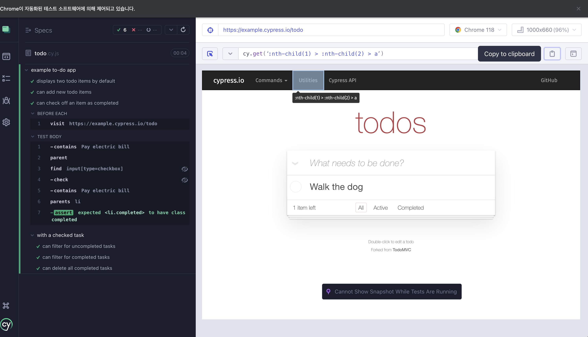

## 8.1 챕터 소개

- 단위테스트와 통합테스트는 iteration speed가 빠르다

- 컴포넌트 테스트는 iteration speed가 빠르다

- 단, realistic browser 환경이 아니다

- 실제로 어플리케이션 동작하는 것 테스트 하는 것 아니라 개별적인 단위에 대해서 테스트를 하고 있다.

- 그렇기 때문에 사용자가 사용하는 브라우저 환경에서 E2E 테스트도 필요하다

## 8.2 공식 문서로 함께 공부 하기 🤓

- E2E를 위한 라이브러리로 selenium을 많이 상요했지만 요즘에는 cypress를 많이 사용한다

- [cypress](https://academy.dream-coding.com/courses/player/react-tdd/lessons/1599)의 장점은 다음과 같다

### Time Travel

- Time travel to see your application’s behavior during test execution step-by-step. Hover over commands to see which elements Cypress acted upon and how your real app responded using simulated user behavior.

### Live Reload

- Watch commands execute and your application under test side-by-side and in real time. Tests automatically re-run on file save for an instant feedback loop so that you can drive development with testing.

### Automatic Waiting

- Never add arbitrary waits or sleeps to your tests. Cypress automatically waits for commands and assertions before moving on. Since commands execute serially, you can write deterministic, predictable tests.

- [공식문서 docs에 있는 영상](https://docs.cypress.io/guides/overview/why-cypress) 만 보아도 전반적으로 이해할 수 있다.

## 8.3 Cypress 설치 하기

- [공식문서 Getting Started](https://docs.cypress.io/guides/getting-started/installing-cypress) 참고한다

```shell

yarn add cypress --dev


```

- 리액트 테스팅 라이브러리는 테스트가 컴포넌트 내부 구현사항을 신경쓸 필요 없이 사용자의 관점에서 작성할 수 있다

- 하지만 cypress 실행해서 보면 아래와 같이 클래스 이름을 기준으로 요소들을 확인하는 것을 확인할 수 있다.



- 테스트를 작성할 때 클래스 이름과 같이 지나친 구현 사항에 의존하면 테스트가 부러지기 쉽다

- 컴포넌트트에서 클래스 이름 변경하거나 어떤 순서로 보여지는 지만 변경해도 테스트가 실패할 수 있기 때문이다

- 이러한 문제를 방지하기 위해 React Testing Library를 사용할 수 있다

  - [Cypress Testing Library](https://testing-library.com/docs/cypress-testing-library/intro)

```shell

yarn add --dev cypress @testing-library/cypress


```
